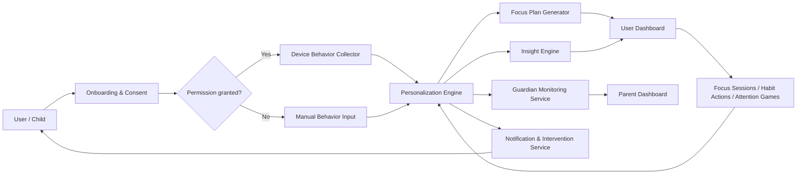
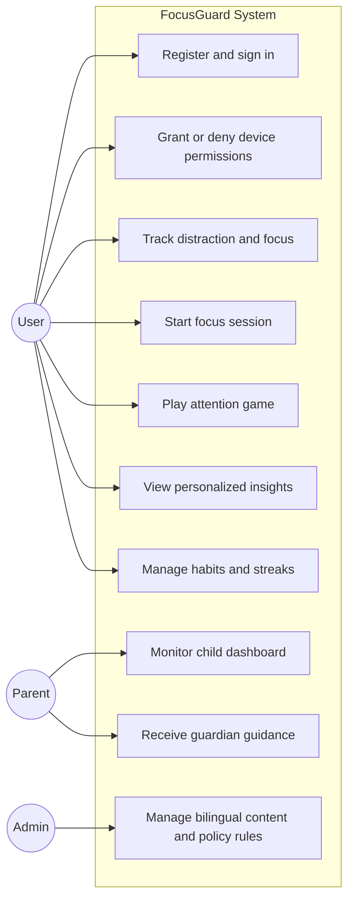
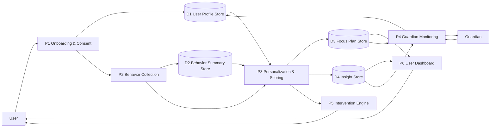
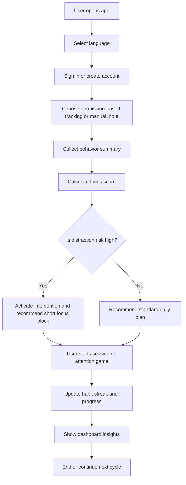
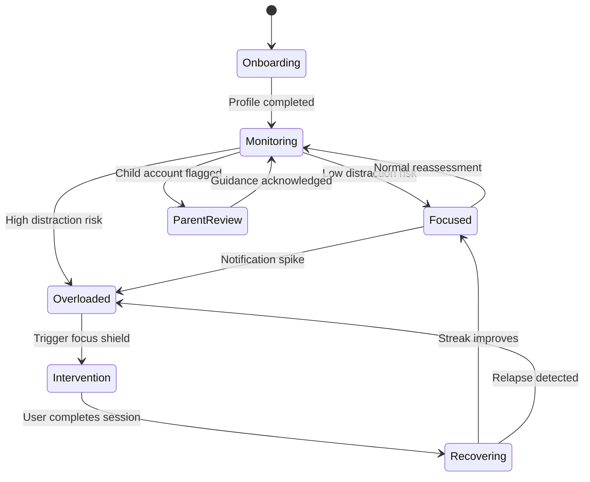
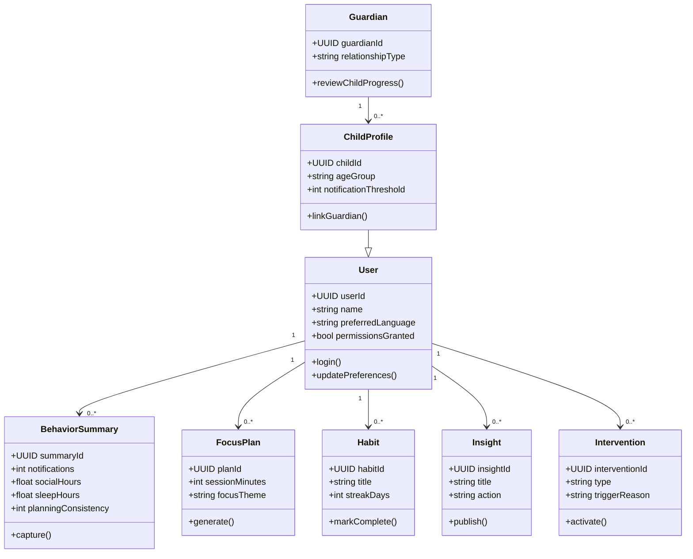
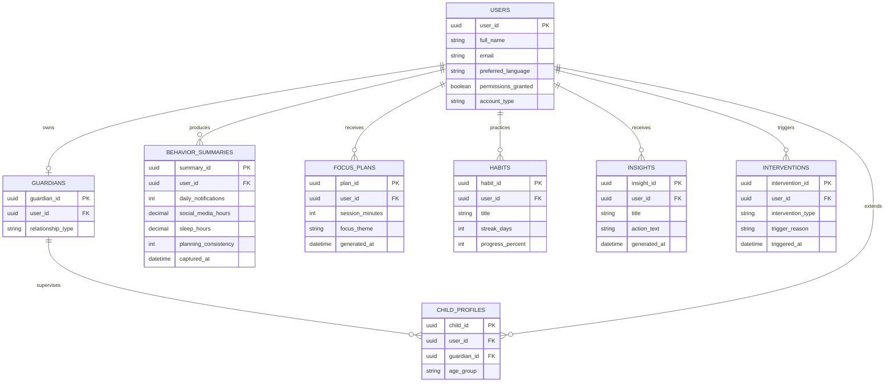

# FocusGuard Diagram Set

Below is a senior-style diagram pack in proper system-analysis formats.

## 1. System Workflow Diagram

## 2. Use Case Diagram

## 3. Data Flow Diagram

## 4. Activity Diagram

## 5. State Diagram

## 6. Class Diagram

## 7. ERD

