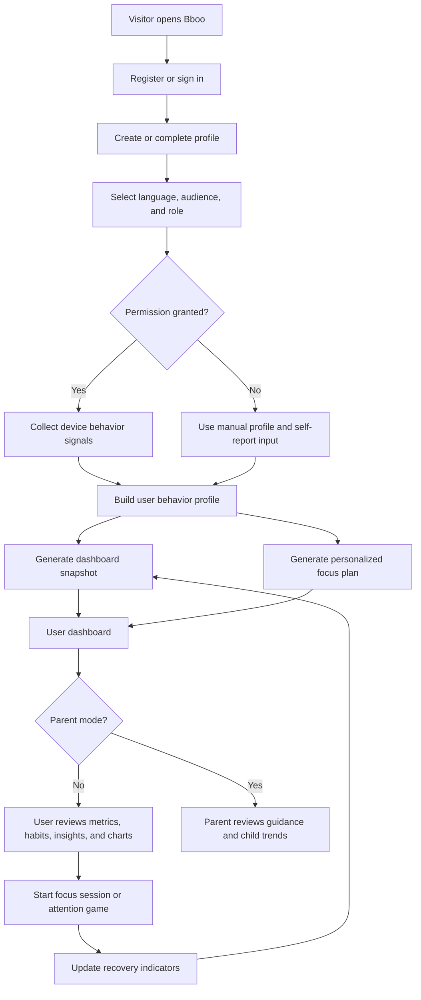
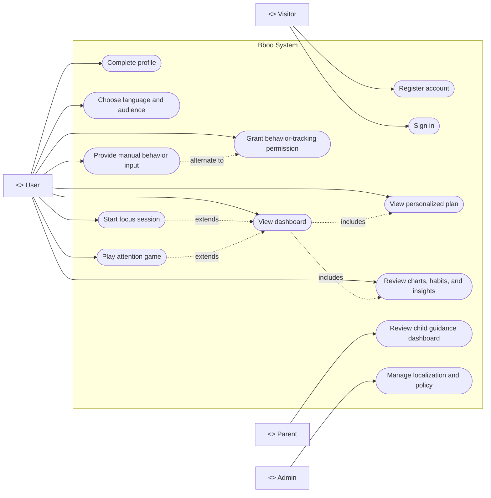
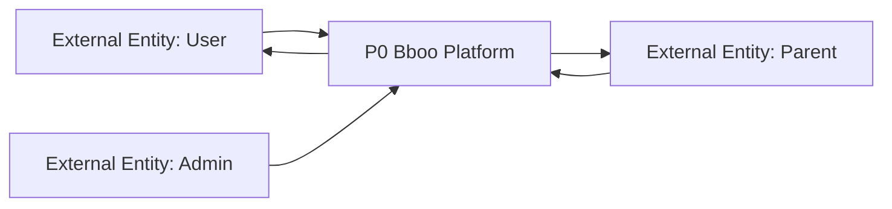
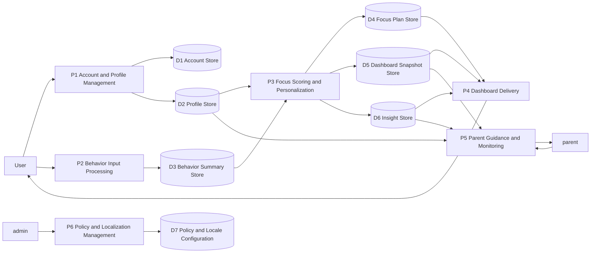
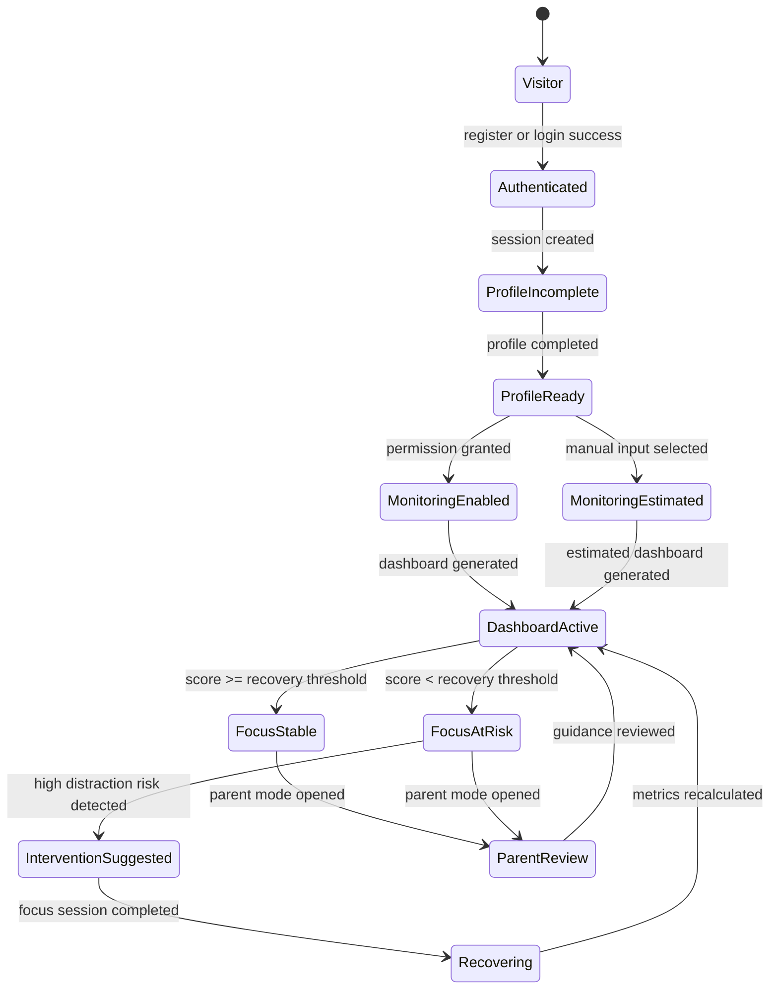
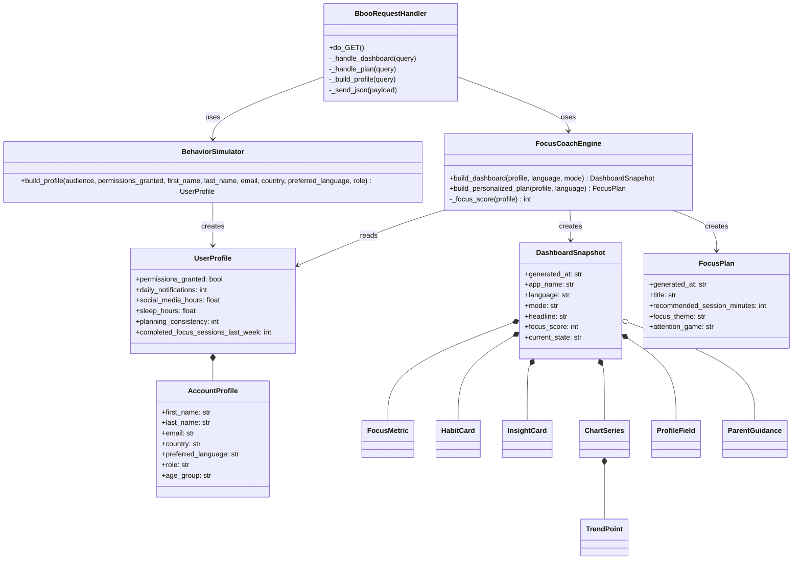
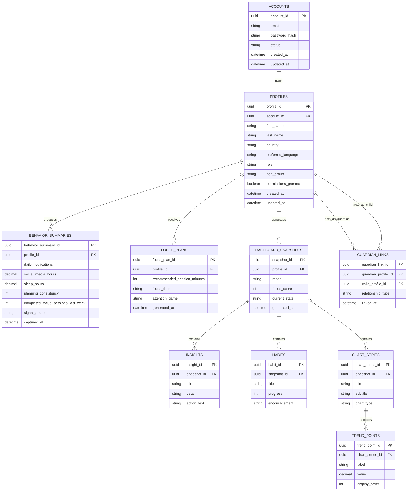

# Bboo Senior Diagram Set

This file provides a cleaner, senior-level diagram pack for the current Bboo system.

Modeling note:

- the workflow, use case, DFD, activity, state, and ERD diagrams describe the intended real system architecture
- the class diagram is aligned to the current Python implementation in this repository

## 1. System Workflow Diagram



## 2. Use Case Diagram



## 3. Data Flow Diagram

### Level 0



### Level 1



## 4. Activity Diagram

```mermaid
flowchart TD
    start(["Start"]) --> a1["Open application"]
    a1 --> a2["Register or sign in"]
    a2 --> a3["Enter profile data"]
    a3 --> a4["Select audience, role, and language"]
    a4 --> a5{"Permission granted?"}

    a5 -->|Yes| a6["Capture behavior signals"]
    a5 -->|No| a7["Use manual behavior input"]

    a6 --> a8["Build user profile"]
    a7 --> a8

    a8 --> a9["Calculate focus score"]
    a9 --> a10["Generate dashboard snapshot"]
    a10 --> a11["Display metrics, charts, habits, and insights"]
    a11 --> a12{"High distraction risk?"}

    a12 -->|Yes| a13["Recommend intervention or attention game"]
    a12 -->|No| a14["Continue normal recovery plan"]

    a13 --> a15["User completes focus session"]
    a14 --> a15

    a15 --> a16["Refresh indicators and trends"]
    a16 --> end(["End"])
```

## 5. State Diagram



## 6. Class Diagram



## 7. ERD



## 8. Senior Modeling Notes

- `System Workflow` shows the end-to-end operational journey from entry to dashboard refresh.
- `Use Case Diagram` focuses on actors and business interactions, not internal processing.
- `DFD` separates external entities, processes, and data stores in proper data-flow style.
- `Activity Diagram` models the procedural path and decision points.
- `State Diagram` models how a user account/session progresses through system states.
- `Class Diagram` reflects the code currently implemented in `app.py`, `agent/focus_engine.py`, `simulator/behavior_simulator.py`, and `shared/schemas.py`.
- `ERD` reflects the production-ready persistence design the current prototype is moving toward.
