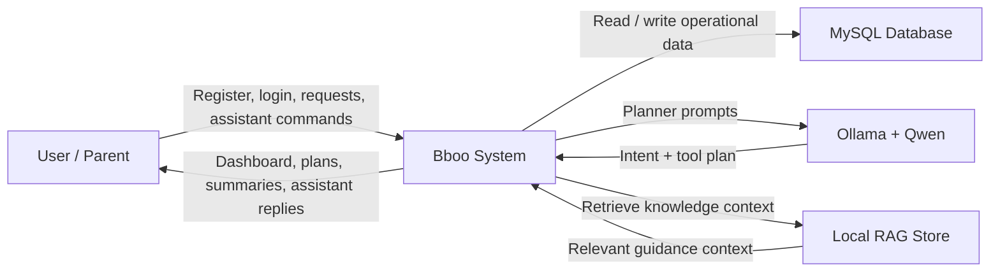
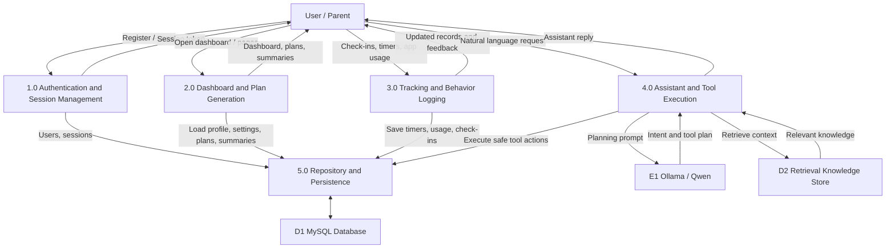
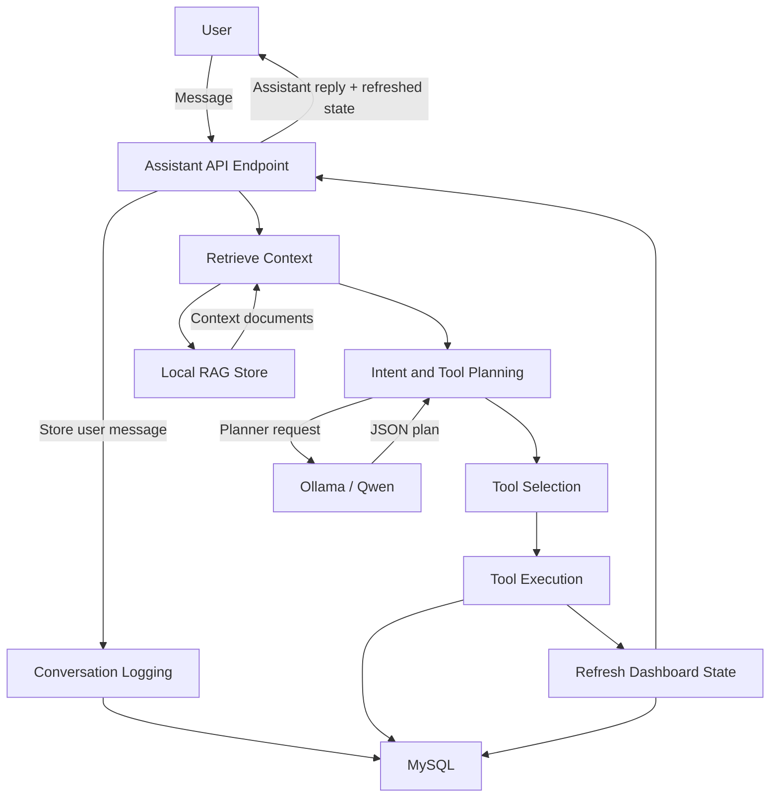
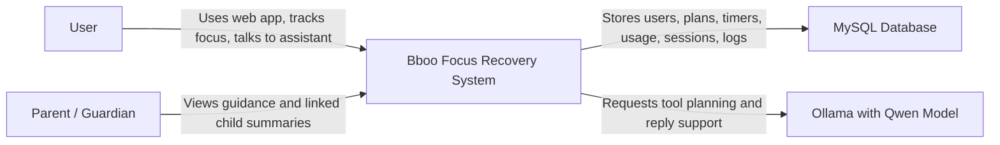
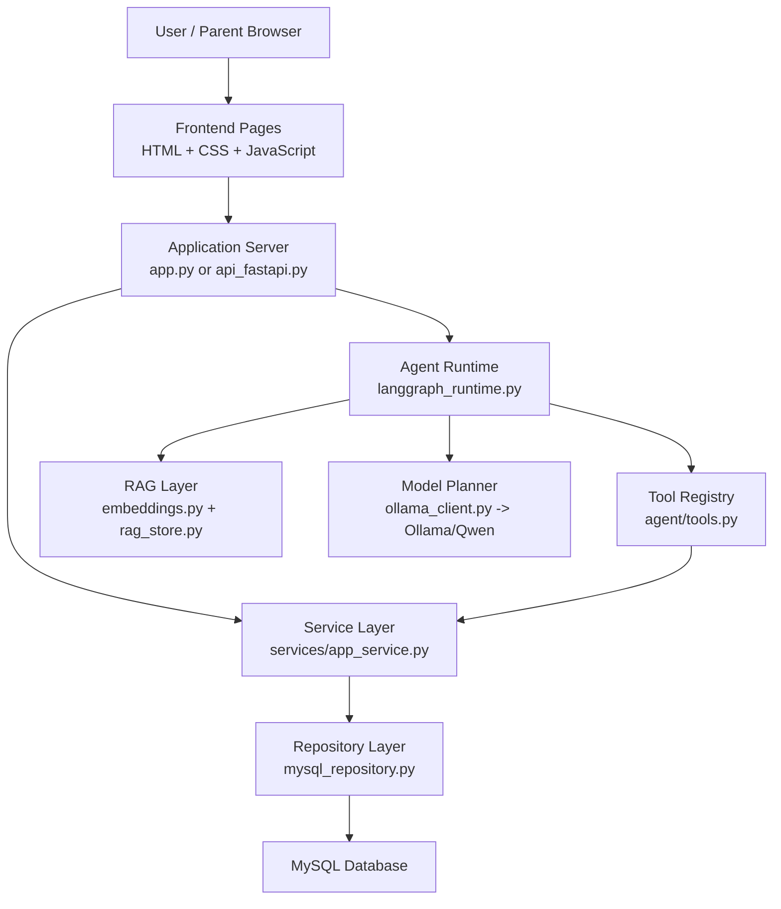
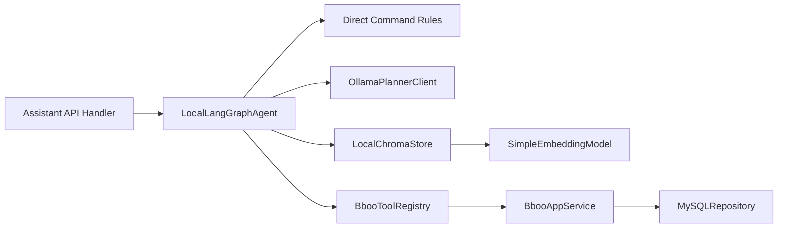

# Bboo DFD and C4 Diagrams

This file contains the Data Flow Diagram views and C4 architecture views for the Bboo system.

---

## 1. DFD Level 0

### Explanation

- The external actor is the user or guardian.
- The core process is the Bboo System.
- The main data stores and integrations are MySQL, Ollama/Qwen, and the local RAG store.

---

## 2. DFD Level 1

### Explanation

- `1.0 Authentication and Session Management` handles account access and tokens.
- `2.0 Dashboard and Plan Generation` builds the visible analytics and plans.
- `3.0 Tracking and Behavior Logging` stores app usage, timers, and check-ins.
- `4.0 Assistant and Tool Execution` handles the agent workflow.
- `5.0 Repository and Persistence` is the database access layer.

---

## 3. DFD Level 2 for Assistant Workflow

### Explanation

- The assistant does not write SQL directly.
- It retrieves context, asks the planner, selects a tool, runs the tool, then refreshes the returned system state.

---

## 4. C4 Context Diagram

### Explanation

- This shows the system as one product and how it interacts with its external actors and systems.

---

## 5. C4 Container Diagram

### Explanation

- The browser talks to the frontend.
- The frontend calls the application server.
- The application server delegates to services and the assistant runtime.
- The assistant runtime uses retrieval, planner, and tools.
- Repository handles database persistence.

---

## 6. C4 Component Diagram for Agent Container

### Explanation

- The agent container contains multiple internal components.
- Direct rules handle explicit commands safely.
- Ollama planner handles flexible model reasoning.
- Retrieval adds helpful context.
- Tools provide the only allowed execution path.

---

## 7. C4 Code-Level Mapping

### Frontend container

- `static/index.html`
- `static/auth.js`
- `static/dashboard.js`
- `static/styles.css`
- `static/dashboard.html`
- `static/usage.html`
- `static/profile.html`
- `static/summary.html`
- `static/checkins.html`
- `static/plan.html`
- `static/insights.html`
- `static/assistant.html`

### Application server container

- `app.py`
- `api_fastapi.py`

### Service container

- `services/app_service.py`

### Agent container

- `agent/langgraph_runtime.py`
- `agent/tools.py`
- `agent/ollama_client.py`
- `agent/rag_store.py`
- `agent/embeddings.py`

### Business intelligence container

- `agent/focus_engine.py`
- `simulator/behavior_simulator.py`

### Persistence container

- `storage/mysql_repository.py`
- `storage/schema.sql`

### Shared domain contracts

- `shared/schemas.py`

---

## 8. How to Use These Diagrams in Presentation

- Use DFD Level 0 for quick explanation of the whole system.
- Use DFD Level 1 for process breakdown.
- Use DFD Level 2 for assistant workflow.
- Use C4 Context to explain product boundaries.
- Use C4 Container to explain major technical blocks.
- Use C4 Component to explain how the assistant works internally.
